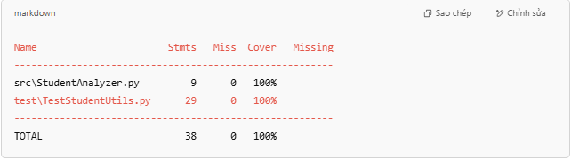

# 📊 StudentAnalyzer - Phân tích điểm sinh viên

Dự án này cung cấp một tập hợp các hàm xử lý dữ liệu điểm số sinh viên, bao gồm:
- Lọc ra những điểm thuộc loại "giỏi"
- Tính điểm trung bình hợp lệ
- Kiểm thử đơn vị (unit test) bằng `unittest`

## 🧪 Các chức năng chính

### `filter_gioi(danh_sach_diem)`
- Trả về danh sách điểm từ 8 trở lên (điểm giỏi), bỏ qua điểm không hợp lệ (âm, lớn hơn 10)

### `average_score(danh_sach_diem)`
- Tính trung bình các điểm hợp lệ trong danh sách (0–10)
- Trả về `0` nếu không có điểm hợp lệ

---

## ▶️ Cách chạy chương trình

### 1. Cài đặt môi trường (tuỳ chọn)

2. Chạy kiểm thử
✅ Cách 1: Chạy trực tiếp từ thư mục gốc

python -m unittest -v test.TestStudentUtils
⚠️ Lưu ý: Đảm bảo bạn đang ở đúng thư mục gốc unit-test-VuVanTien/

📌 Ví dụ kết quả kiểm thử

--- Bắt đầu chạy 1 test case ---
[test_loc_diem_gioi_toan_bo_hop_le] Kết quả: [10, 9, 8.5]
--- Kết thúc test case ---

--- Bắt đầu chạy 1 test case ---
[test_tinh_diem_tb_toan_bo_hop_le] Kết quả: 9.00
--- Kết thúc test case ---
...

📈 Đo độ bao phủ kiểm thử
Bước 1: Chạy kiểm thử với coverage:
coverage run -m unittest discover

Bước 2: Hiển thị báo cáo:
coverage report -m

✅ Kết quả đo coverage

📃 Tác giả
💻 Tên: Vũ Văn Tiến

🔍 Môn học: Kiểm thử phần mềm

📅 Năm học: 2025

